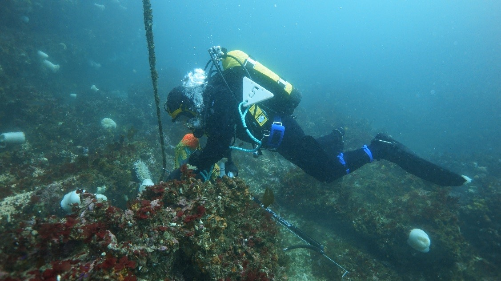
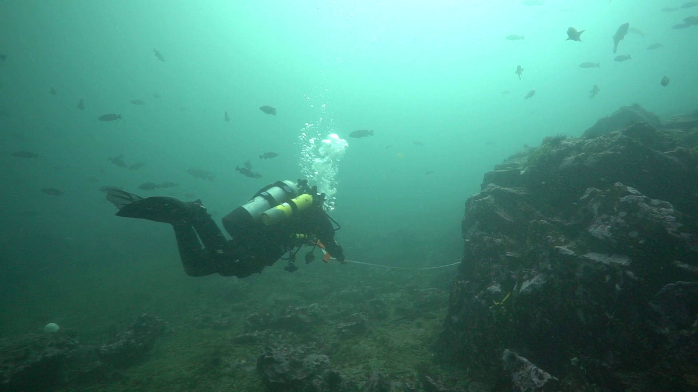
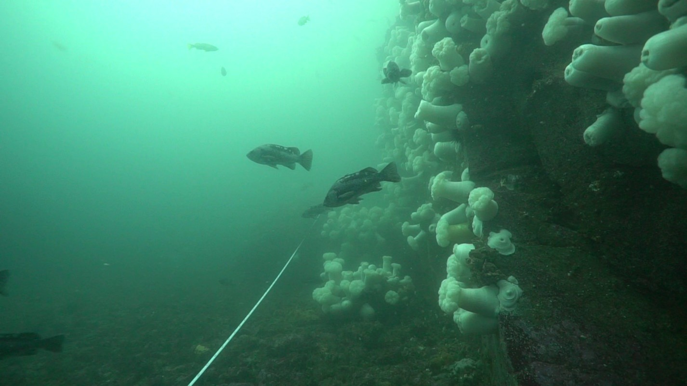
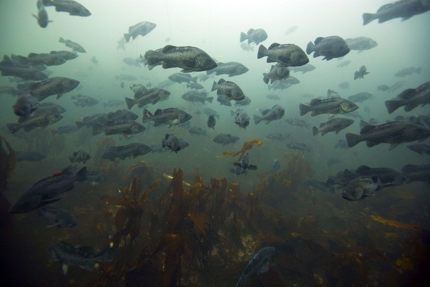
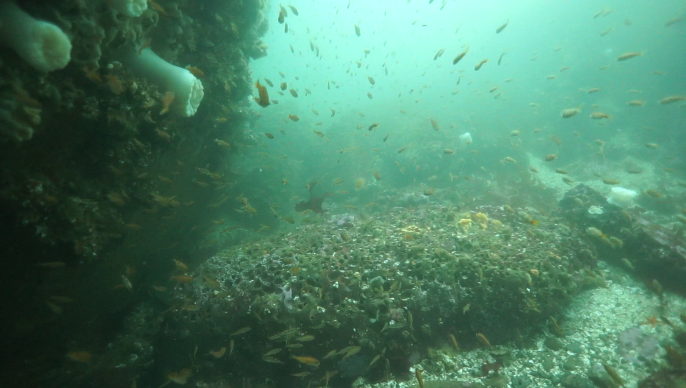
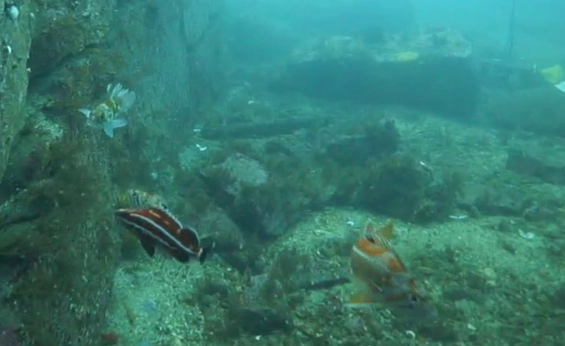

# Seattle_Aquarium_Neah_Bay_subtidal_monitoring
This repository provides a home for all data, code, and figures associated with the Seattle Aquarium's Neah Bay subtidal rockfish monitoring program

  
   

  
   

  
   

